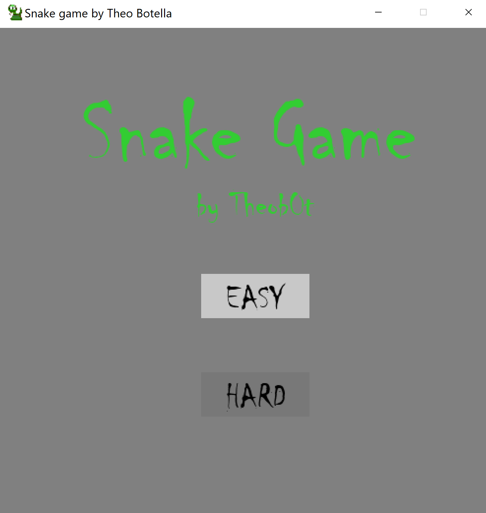
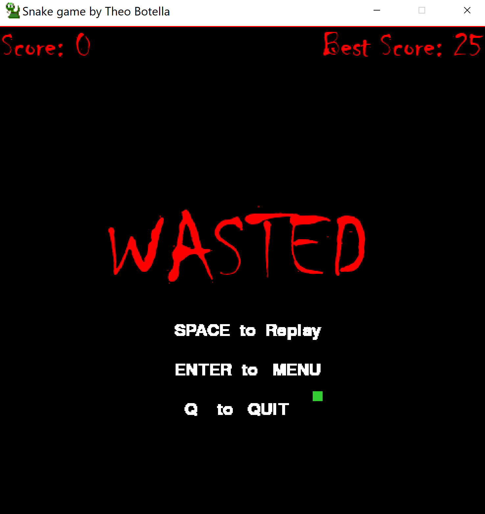
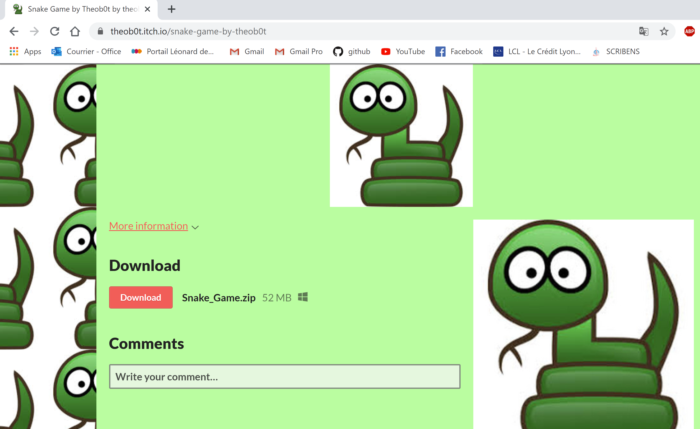

## :snake: Snake_Game_CV :snake:
## Snake game with Pygame controlled by gesture

## :dart: PROJECT GOAL
The goal of the project is to create a Snake game for Windows machine and to publish it online. </br>
(UPDATE: and add Control Gesture to move the Snake)

<p align="center">
  

## UPDATE: MOTION CONTROL added using COMPUTER VISION and NEURAL NET to control the snake

<p align="center">
  
  
### Capture gesture and predict the move:
- Using OpenCV library you can open your webcam and save each new frame into a jpeg (


- Use this jpeg as an input for the neural network model

- Neural Network built using Teachable Machine by Google https://teachablemachine.withgoogle.com/train
('./model/keras_model.h5' and 'keras_model.py')


## :memo: REQUIREMENTS

### Software:
-	Working on Windows machine
-	Coded in Python
-	Welcome Menu (select difficulty)
-	Frame size is 500*500 pixels
-	Display current score and store best score locally
-	User plays using arrows of the keyboard
-	Game is downloadable on http://www.itch.io <br> (https://theob0t.itch.io/snake-game-by-theob0t)
<br/><br/>


<br/><br/><br/><br/><br/><br/><br/><br/>
<br/><br/><br/><br/><br/><br/><br/><br/><br/>


### Rules:
-	Snake starts in the center of the screen with size of 10x10 pixels
-	Place food somewhere randomly in the screen
-	Food size is 10x10 pixels
-	Snake can move up, down, right and left
-	Snake can’t reverse
-	When Snake eat food it grows of one block (10x10 pixels)
-	Snake dies if it hits itself or a border of the screen


## Installation

### Open CMD and clone repository
```git clone https://github.com/Theob0t/Snake_Game.git```

### Navigate to folder
```cd Snake_Game```

### Run setup.py
```python setup.py build```

### Copy data_files to EXE folder
```xcopy data build\exe.win-amd64-3.8\data```

### Navigate to the EXE file
```cd build/exe.win-amd64-3.8```

### Run Snake_Game
```Snake_Game```


## DOWNLOAD AND PLAY from itch.io
https://theob0t.itch.io/snake-game-by-theob0t

<p align="center">
  
</p>
