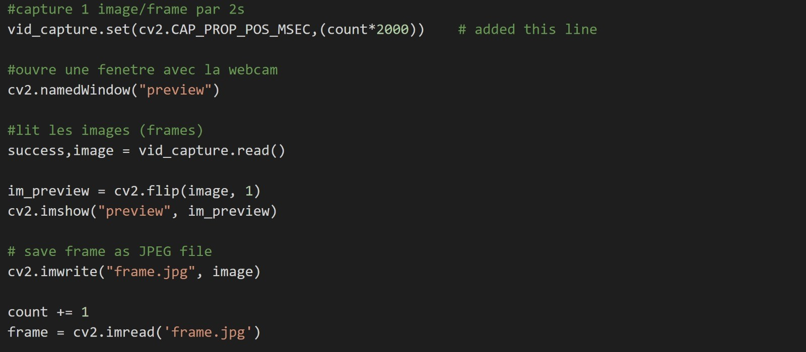
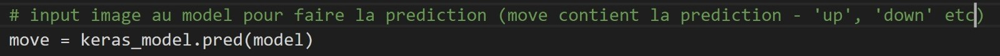

## :snake: Gesture Gaming  :snake:
## Gesture Controlled Snake Game 
with Pygame, OpenCV and Keras

## :dart: PROJECT GOAL
The goal of the project is to create a Gesture Conrtolled Snake game for Windows machine.

  

## :memo: REQUIREMENTS

### Software:
-	Welcome Menu (select difficulty)
-	Display current score and store best score locally
-	User plays using gesture (on camera/webcam)

 

        
         

### Rules:
-	Snake starts in the center of the screen with size of 10x10 pixels
-	Place food somewhere randomly in the screen
-	Food size is 10x10 pixels
-	Snake can move up, down, right and left
-	When Snake eat food it grows of one block (10x10 pixels)
-	Snake dies if it hits itself or a border of the screen

  
### Capture gestures and predict the move:
- Using OpenCV library you can open your webcam and save each new frame into a jpeg

 

- Use this jpeg as an input for the neural network model

 

- Neural Network built using Teachable Machine by Google https://teachablemachine.withgoogle.com/train
('./model/keras_model.h5' and 'keras_model.py')

 
